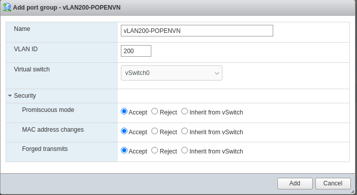

# Ghi chép về cách cài đặt và crack OpenVPN Access Server trên VMWare ESXI
**Hướng dẫn cài đặt**
## 1. Cấu hình card mạng trên ESXI trên cả 2 ESXI
Trong **Networking** tạo 1 **Port Group**  
Mục **Security** chọn **Accept** *Promiscuous mode, MAC address changes, Forged transmits*  

## 2. Tạo VM chạy Alma Linux trên cả 2 ESXI

### 2.1 Cấu hình cơ bản trên 2 VM
