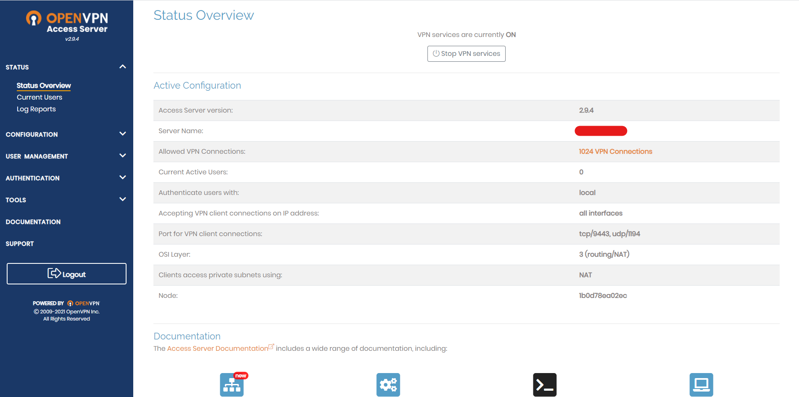

# Hướng dẫn crack OpenVPN Access Server trên Rrel8/Alma8/Rocky8 #
## 1. Cài đặt OpenVPN Access Server ##
- Cài đặt các Packages cơ bản  

```sh
dnf install vim curl wget net-tools telnet unzip zip -y && dnf update -y
```

- Mở các port cần thiết  
```sh
sudo firewall-cmd --zone=public --add-port={443/tcp,943/tcp,1194/tcp} --permanent
sudo firewall-cmd --reload
```
- Cài đặt OpenVPN Access Server  

```sh
sudo dnf -y install https://as-repository.openvpn.net/as-repo-rhel8.rpm
sudo dnf -y install openvpn-as
```
Sau khi cài đặt xong sẽ có thông tin đăng nhập (user admin: openvpn và passwd random)  
Không đăng nhập vào OpenVPN mà chuyển luôn sang crack

 
## 2. Crack OpenVPN Access Server ##
- Tắt service openvpn  
```sh
sudo service openvpnas stop
```
Thư mục **/usr/local/openvpn_as/lib/python** chứa toàn bộ thư viện openvpn-as sử dụng, đương nhiên bao gồm cả phần license. phần license do thư viện pyovpn-2.0-py3.6.egg xử lý. Tiến hành edit lại file này để unlock, backup file gốc, tạo thư mục mới để làm việc tạm.  

- Tạo thư mục trong tmp và copy file **/usr/local/openvpn_as/lib/python/pyovpn-2.0-py3.6.egg** vào thư mục đó  
```sh
mkdir /tmp/crack-openvpn
cp /usr/local/openvpn_as/lib/python/pyovpn-2.0-py3.6.egg /usr/local/openvpn_as/lib/python/pyovpn-2.0-py3.6.egg.bak
cp /usr/local/openvpn_as/lib/python/pyovpn-2.0-py3.6.egg /tmp/crack-openvpn
```
Bản chất egg là file zip nên chỉ cần giải nén là có thể edit được nội dung.
- Giải nén file pyovpn-2.0-py3.6.egg bằng unzip  

```sh
cd /tmp/crack-openvpn
unzip pyovpn-2.0-py3.6.egg
```
Kết quả  
```sh
[it@VM-OPENVPN]$ ls -al
total 5824
drwxr-x---.  5 it   it        78 May 23 22:27 .
drwxr-xr-x.  2 it   it        79 May 23 17:21 common
drwxr-xr-x.  2 it   it       106 May 23 17:21 EGG-INFO
drwxr-xr-x. 37 it   it      4096 May 23 17:21 pyovpn
-rw-r-----.  1 it   it   5959376 May 23 22:27 pyovpn-2.0-py3.6.egg
```
- Đổi tên file **uprop.pyc** trong thư mục **pyovpn/lic**
```sh
mv pyovpn/lic/uprop.pyc pyovpn/lic/uprop2.pyc
```
- Tạo 1 file uprop.pyc với nội dung 
```
from pyovpn.lic import uprop2
old_figure = None

def new_figure(self, licdict):
    ret = old_figure(self, licdict)
    ret['concurrent_connections'] = 1024
    return ret


for x in dir(uprop2):
    if x[:2] == '__':
        continue
    if x == 'UsageProperties':
        exec('old_figure = uprop2.UsageProperties.figure')
        exec('uprop2.UsageProperties.figure = new_figure')
    exec('%s = uprop2.%s' % (x, x))
```
Trên dòng **ret['concurrent_connections'] = 1024** có thể sửa 1024 sang các số khác tối đã nên để 2048  

- Sau đó mã hóa file và chuyển file mã hõa vào thư mục **pyovpn/lic**  
```sh
python3 -O -m compileall uprop.py && mv __pycache__/uprop.cpython-36.opt-1.pyc pyovpn/lic/uprop.pyc
```
**Lưu ý:** Tên file **uprop.cpython-36.opt-1.pyc** sẽ được thay đổi theo phiên bản python  

- Nén lại file và đổi tên file về như cũ  
```sh
zip -r pyovpn-2.0-py3.6.egg.zip common EGG-INFO pyovpn
rm -rf pyovpn-2.0-py3.6.egg
mv pyovpn-2.0-py3.6.egg.zip pyovpn-2.0-py3.6.egg
```
- Xóa file cũ */usr/local/openvpn_as/lib/python/pyovpn-2.0-py3.6.egg* và */usr/local/openvpn_as/lib/python/__pycache__*  
```sh
sudo rm -rf /usr/local/openvpn_as/lib/python/pyovpn-2.0-py3.6.egg /usr/local/openvpn_as/lib/python/__pycache__
```
Chuyển file **pyovpn-2.0-py3.6.egg** vừa nén vào thư mục **/usr/local/openvpn_as/lib/python/** và phân lại quyền  
```sh
mv pyovpn-2.0-py3.6.egg /usr/local/openvpn_as/lib/python/
sudo chown root.root /usr/local/openvpn_as/lib/python/pyovpn-2.0-py3.6.egg
sudo chmod 600 /usr/local/openvpn_as/lib/python/pyovpn-2.0-py3.6.egg
```
Khởi động lại service  
```sh
sudo service openvpnas restart
```

**Kết quả**  



## 3. [Script crack OpenVPN ](../script/crack-openvpnas.sh) ##


