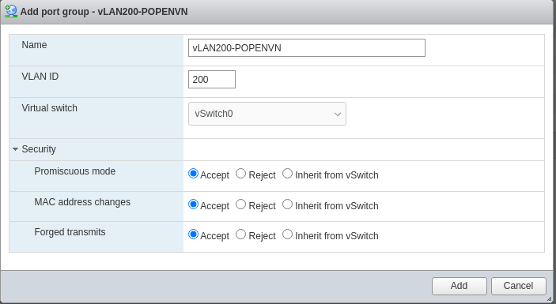

# Setting up high-availability failover mode

## 1. Cấu hình card mạng trên ESXI trên cả 2 ESXI
Trong **Networking** tạo 1 **Port Group**  
Mục **Security** chọn **Accept** *Promiscuous mode, MAC address changes, Forged transmits*  

## 2. Tạo VM chạy Alma Linux trên cả 2 ESXI
Tạo 2 máy ảo chạy trên 2 port group trên
### 2.1 Cài đặt môi trường trên cả 2 server
- Cài đặt rsync  
```sh
sudo dnf update -y
sudo dnf install rsync
```
- Cấu hình ssh hai chiều  
Cấu hình **SSH key** trên tài khoản **root** của cả 2 server  
 ```sh
root@VM-OPENVPN-MASTER:~# ssh-keygen 
Generating public/private rsa key pair.
Enter file in which to save the key (/root/.ssh/id_rsa): 
Created directory '/root/.ssh'.
Enter passphrase (empty for no passphrase): 
Enter same passphrase again: 
Your identification has been saved in /root/.ssh/id_rsa.
Your public key has been saved in /root/.ssh/id_rsa.pub.
The key fingerprint is:
SHA256:bxiQGqyFNG5S3FIG+UqLr+DhlhWJd/ZnUxanhcnlD0M root@VM-OPENVPN-MASTER
The key's randomart image is:
+---[RSA 3072]----+
| .==o     . +E   |
| ++=.  .   =oo   |
|. =o= o     =+   |
| +.*.= .   +  +  |
| ooo= . S o    . |
|. o.   . B       |
|.oo     + +      |
|+oo      .       |
|o+               |
+----[SHA256]-----+
```
**Trên Master chạy lệnh ssh-copy-id sang Slave**  
```sh
ssh-copy-id root@192.168.70.2
```
**Trên Slave chạy lệnh ssh-copy-id sang Master**  
```sh
ssh-copy-id root@192.168.70.1
```
Để kiểm tra xem ssh key có hoạt động hay không thử ssh từ Master sang Slave  
```sh
ssh root@192.168.70.2
```
### 2.2 Cài đặt OpenVPN  ###
Cài đặt OpenVPN Access Server trên cả 2 server  
```sh
dnf -y install https://as-repository.openvpn.net/as-repo-rhel8.rpm
dnf -y install openvpn-as
```
## Crack OpenVPN Access Server ##
